# MRITestData.jl

<a href="https://hakkelt.github.io/MRITestData.jl/stable/"></a>
<a href="https://hakkelt.github.io/MRITestData.jl/dev/"></a>
<a href="https://github.com/hakkelt/MRITestData.jl/actions/workflows/CI.yml?query=branch%3Amaster"></a>
<a href="https://codecov.io/gh/hakkelt/MRITestData.jl"></a>
<a href="https://github.com/JuliaTesting/Aqua.jl"></a>
<a href="https://github.com/aviatesk/JET.jl"></a>
<a href="https://github.com/fredrikekre/Runic.jl"></a>
<a href="LICENSE"></a>

Query and download free, open-access **MRI k-space datasets** and load them into
`MRIBase.RawAcquisitionData`, so reconstruction code (e.g.
[MRIReco.jl](https://github.com/MagneticResonanceImaging/MRIReco.jl)) can be exercised
on real scanner data instead of only synthetic phantoms.

> [!IMPORTANT]
> The MIT license covers **this package's code only**. Datasets you download are
> governed by **each provider's own license and terms** (mridata.org per-dataset
> terms; OCMR's data-use terms and required citation; CMRxRecon2024's challenge
> registration and citation; fastMRI's Dataset Agreement). You are responsible for
> complying with them. See
> [Licensing & legal](https://hakkelt.github.io/MRITestData.jl/stable/legal/).

Supported sources:

| Source | Contents | Format |
| --- | --- | --- |
| [`MRIDATA`](https://mridata.org) | multi-vendor raw k-space (knee, brain, …) | ISMRMRD `.h5` |
| [`OCMR_SOURCE`](https://ocmr.info) | cardiac multi-coil cine (fully sampled + undersampled) | ISMRMRD `.h5` |
| [`CMRXRECON2024`](https://cmrxrecon.github.io/2024/) | cardiac multi-coil (cine, aorta, mapping, tagging, …) | MATLAB `.mat` |
| [`CMRXRECON300`](https://www.synapse.org/Synapse:syn52965326) | undersampled cardiac k-space + ACS, 300 volunteers (cine + T1/T2 mapping) | MATLAB `.mat` |
| [`USC_SPEECH`](https://sail.usc.edu/span/75speakers/) | 8-channel spiral vocal-tract speech rtMRI (GE 1.5 T), 75 speakers | ISMRMRD `.h5` |
| [`M4RAW`](https://github.com/mylyu/M4Raw) | 4-channel fully-sampled Cartesian brain k-space (0.3 T low-field), 183 subjects | fastMRI `.h5` |
| [`FASTMRI`](https://fastmri.med.nyu.edu) | knee, brain, prostate, breast multi-coil k-space (NYU/FAIR); form-gated, 90-day signed URLs | fastMRI `.h5` |

mridata.org, OCMR and USC Speech serve ISMRMRD, read via
[`MRIFiles`](https://github.com/MagneticResonanceImaging/MRIFiles.jl)/`MRIBase`.
The CMRxRecon sources ship MATLAB v7.3 `.mat` k-space (read via
[`MAT.jl`](https://github.com/JuliaIO/MAT.jl)); M4Raw and fastMRI ship fastMRI-layout
`.h5` (`kspace`/`reconstruction_rss`/`ismrmrd_header`); all are converted to a cached
ISMRMRD file on first load, so every source flows through the same
`list_datasets` → `download_dataset` → [`load_raw`](#working-with-the-raw-data)
pipeline and yields a `RawAcquisitionData`.

Full documentation: **<https://hakkelt.github.io/MRITestData.jl/dev/>** — start with
[Concepts & data model](https://hakkelt.github.io/MRITestData.jl/dev/concepts/) and the
[Tutorial](https://hakkelt.github.io/MRITestData.jl/dev/tutorial/).

## Installation

The package is **not yet registered in the General registry**:

```julia
using Pkg
Pkg.add(url = "https://github.com/hakkelt/MRITestData.jl")
```

`MRITestData` depends on `MRIFiles`/`MRIBase` (which pull in HDF5) but **not** on any
reconstruction package — reconstruction is left to the caller (see below).

## Discovering datasets (offline)

```julia
using MRITestData

list_sources()                                  # [MRIDATA, OCMR_SOURCE, CMRXRECON2024, CMRXRECON300, USC_SPEECH, M4RAW, FASTMRI]
list_datasets(OCMR_SOURCE; fully_sampled = true)
list_datasets(MRIDATA; anatomy = :knee, field_strength = 3.0)

# Filters: scalar (==), vector/tuple (membership), or a predicate function
list_datasets(MRIDATA; receiver_channels = c -> c !== nothing && c >= 8)

# Across sources, extra keys and free text:
query(; anatomy = :knee, fully_sampled = true)
query(; text = "prisma")
```

## Interactive browser

`run_browser()` (or the standalone `mridata-browser` app) opens a full-screen terminal
browser to filter, search, sort and download datasets:



```julia
run_browser()                        # all sources
run_browser(; sources = OCMR_SOURCE, offline = true)
```

Keys: `↑↓` move · `/` search · `f` filter · `1`-`9` sort · `d` details pane · `⏎`
download · `q` quit.

## Working with the raw data

`load_raw` accepts an ISMRMRD path **or** a catalog entry/handle (downloaded and
cached on first use) and returns an `MRIBase.RawAcquisitionData`:

```julia
using MRITestData

entry = first(list_datasets(OCMR_SOURCE; fully_sampled = true))
raw   = load_raw(entry)      # MRIBase.RawAcquisitionData (profiles + XML header)
```

Any mridata.org UUID works even if it is not in the curated catalog:

```julia
raw = load_raw(dataset(MRIDATA, "52c2fd53-d233-4444-8bfd-7c454240d314"))
```

## Reconstruction with MRIReco

Reconstruction is left to a dedicated package such as
[MRIReco.jl](https://github.com/MagneticResonanceImaging/MRIReco.jl). Build an
`AcquisitionData` from the loaded raw data and reconstruct:

```julia
using MRITestData, MRIReco

raw = load_raw(first(list_datasets(OCMR_SOURCE; fully_sampled = true)))
acq = AcquisitionData(raw)

params = MRIReco.defaultRecoParams()
params[:reco] = "direct"                     # inverse FFT — fully-sampled data
img = MRIReco.reconstruction(acq, params)    # AxisArray [x, y, z, echo, coil, rep]
```

Undersampled sources (`CMRXRECON300`, OCMR `us_*`, fastMRI test/prostate/breast) alias
under a direct recon — use CG-SENSE with ESPIRiT coil maps instead. Full example and
method references:
[Reconstructing undersampled data](https://hakkelt.github.io/MRITestData.jl/dev/usage/#Reconstructing-undersampled-data)
and `examples/reconstruct_all_types.jl`.

## CMRxRecon2024 (Synapse access)

The [CMRxRecon2024](https://cmrxrecon.github.io/2024/) cardiac dataset — fully-sampled
multi-coil Cartesian k-space across six modalities (Cine, Mapping, Aorta, Tagging,
Flow2d, BlackBlood) for Training / Validation / Test subjects — is hosted on
[Synapse](https://www.synapse.org) as two giant ZIP archives, each split into 4 GiB
fragments (training and after-competition). Rather than downloading all of it,
`MRITestData` extracts **individual `.mat` files** on demand using HTTP byte-range
requests against a pre-computed offset map — you only download the bytes for the file
you ask for. Both archives are handled identically.

Access is gated. **All of these steps are required** before a token can download data:

1. Register for a free **Synapse account** at [synapse.org](https://www.synapse.org).
2. Apply to **join the CMRxRecon2024 challenge** and complete the external
   team-information form. This is mandatory — see the
   [challenge site](https://cmrxrecon.github.io/2024/Task2.html).
3. ⚠️ Until the challenge registration is finalized, your Personal Access Token (PAT)
   will **not** have the backend permissions to download the data fragments.
4. Create a Synapse **PAT** with *view* + *download* scopes.

Then point `MRITestData` at your token and pull files:

```julia
using MRITestData

MRITestData.set_synapse_token!("your-synapse-pat")   # persisted across sessions
# …or set ENV["SYNAPSE_AUTH_TOKEN"] (takes precedence)

list_datasets(CMRXRECON2024; offline = true, fully_sampled = true)

entry = first(list_datasets(CMRXRECON2024; offline = true))
path  = download_dataset(entry)     # range-extracts + inflates just this .mat
data  = load_mat(entry)             # downloads (cached) then reads via MAT.jl
```

See the [FAQ](https://cmrxrecon.github.io/2024/FAQ.html) for terms and citation
requirements. Maintainer tooling for regenerating the offset map and bulk-downloading
the archives lives in [`scripts/`](scripts/README.md).

## CMRxRecon-300 (Synapse access)

The [CMRxRecon-300](https://www.synapse.org/Synapse:syn52965326) dataset (the *Scientific
Data* 2024 release) is raw multi-coil cardiac k-space from 300 volunteers — cine plus
T1/T2 mapping — hosted on Synapse as `.tar.gz` archives split into 16 GiB fragments
(≈580 GB total). It is **CC-BY** and needs only a free Synapse account (no challenge
registration). The `_ks` k-space is **undersampled** (regular k-t pattern, R≈3) and paired
with fully-sampled ACS `_calib` files; `load_raw` records the true sampling, so an
artifact-free image needs parallel imaging (ESPIRiT/CG-SENSE), not a plain inverse FFT.

A `.tar.gz` is one continuous gzip stream and cannot be range-extracted per file like a
ZIP, so `MRITestData` ships a precomputed **zran** (zlib random-access) checkpoint index
with one checkpoint placed just before each file: to fetch one `.mat` it resumes
decompression immediately before that file and issues HTTP range requests, streaming
essentially just the file instead of the whole archive. Loading is identical to every
other source:

```julia
MRITestData.set_synapse_token!("your-synapse-pat")     # a free Synapse account suffices

entry = first(list_datasets(CMRXRECON300; offline = true))
raw   = load_raw(entry)             # zran-extracts the .mat, converts to ISMRMRD, loads
```

Building or refining the checkpoint index from the archives is a maintainer task — see
[`scripts/index_cmrxrecon300.jl`](scripts/README.md).

## USC Speech (figshare, CC-BY)

The [USC SPAN 75-speaker](https://sail.usc.edu/span/75speakers/) dataset (figshare
[13725546](https://doi.org/10.6084/m9.figshare.13725546), CC-BY 4.0) is real-time speech
production MRI: 75 speakers on a GE Signa Excite **1.5 T** scanner with a custom
**8-channel** upper-airway array, acquired with a **13-interleaf spiral-out** spoiled GRE.
Only the **2drt** mid-sagittal vocal-tract raw k-space is cataloged. Unlike the CMRxRecon
sources it is already vendor-agnostic **MRD/ISMRMRD `.h5`** (k-space samples plus
trajectory and density-compensation tables), so it loads through the default `load_raw`
path with no `.mat` conversion — and adds **non-Cartesian (spiral), 1.5 T** raw data to the
otherwise Cartesian collection.

The corpus is a single ~570 GB `dataset.zip` on figshare (no account needed). To fetch one
`.h5` member, `MRITestData` reads the archive's ZIP central directory once (committed as
`data/usc_speech_map.csv`) and issues an HTTP range request for just that member —
figshare's `ndownloader` 302-redirects to a short-lived presigned S3 URL that supports
ranges. Loading is identical to every other source:

```julia
entry = first(list_datasets(USC_SPEECH; offline = true))
raw   = load_raw(entry)             # ZIP range-extracts + inflates the .h5, then loads
```

Regenerating the offset map from the figshare archive is a maintainer task — see
[`scripts/generate_usc_speech_map.jl`](scripts/README.md).

## M4Raw (Zenodo, CC-BY)

The [M4Raw](https://github.com/mylyu/M4Raw) dataset (Zenodo
[8056074](https://doi.org/10.5281/zenodo.8056074), CC-BY 4.0) is **low-field brain** MRI:
183 volunteers on a **0.3 T** whole-body scanner with a **4-channel** head coil. Each member
is one *study × contrast × repetition* (T1w / T2w / FLAIR, plus T1 GRE) of **fully-sampled
Cartesian** k-space in the **fastMRI HDF5** layout
(`kspace`/`reconstruction_rss`/`ismrmrd_header`), converted to a cached ISMRMRD file on first
load — so a plain inverse FFT reconstructs it. This adds the package's first **low-field
(0.3 T) brain** source.

The corpus ships as several multi-GB ZIPs on Zenodo (no account needed). To fetch one `.h5`
member, `MRITestData` reads each archive's ZIP central directory once (committed as
`data/m4raw_map.csv`) and issues a single HTTP range request for just that member. Loading is
identical to every other source:

```julia
entry = first(list_datasets(M4RAW; offline = true))
raw   = load_raw(entry)             # ZIP range-extracts + inflates the .h5, then converts + loads
```

Regenerating the offset map from the Zenodo archives is a maintainer task — see
[`scripts/generate_m4raw_map.jl`](scripts/README.md).

## fastMRI (NYU / FAIR, form-gated)

The [fastMRI](https://fastmri.med.nyu.edu) dataset provides knee, brain, prostate, and
breast multi-coil k-space acquired on clinical Siemens/GE scanners, in the fastMRI HDF5
layout (`kspace`/`reconstruction_rss`/`ismrmrd_header`) — the same format as M4Raw.

Access is gated by a [data-use agreement](https://fastmri.med.nyu.edu) form. After
approval you receive an automated email containing AWS S3 pre-signed URLs for the
archives (≈60–250 GB each; knee and brain as `.tar.xz`, prostate and breast as
`.tar.gz`). The URLs are **time-limited** (90 days) and carry per-file unique signatures.

To register the credentials, paste the full email body once:

```julia
using MRITestData

# Paste the entire confirmation email (or just the curl-command block) as a string:
MRITestData.set_fastmri_urls!(read("fastmri_email.txt", String))  # persisted across sessions

MRITestData.fastmri_url_expires()   # check when credentials expire (DateTime UTC)
```

Individual `.h5` scan files are extracted without downloading the archive whole: knee and
brain via **xz block-level HTTP range requests** (`scripts/index_fastmri.jl`), prostate and
breast via the **zran** checkpoint approach used for CMRxRecon-300 (`scripts/index_fastmri_gz.jl`).
Both write to `data/fastmri_map.csv`. Until the map is populated the catalog is empty.
Loading is identical to every other source:

```julia
entries = list_datasets(FASTMRI; offline = true)
raw     = load_raw(first(entries))    # range-extracts the .h5, converts to ISMRMRD, loads
```

## Caching

Downloads are cached in a per-package scratchspace (persists across sessions).
Transfers go to a temporary `.part` file and are renamed atomically on success,
so an interrupted download never poisons the cache. A `.meta.toml` sidecar records
the URL, size and SHA-256.

```julia
cache_path(entry); is_cached(entry)
clear_cache()                       # all sources
clear_cache(; source = OCMR_SOURCE) # one source
```

## Notes / current limitations (v1)

- **Image size** is taken from the ISMRMRD `encodedSize` (no automatic crop to
  `reconSize`; oversampling/partial-Fourier dimensions are preserved).
- **Density compensation** is not estimated — non-Cartesian datasets load with
  `dcf = nothing`. Supply your own DCF if your reconstruction needs it.
- The committed **mridata.org catalog** ([`data/mridata_index.toml`](data/mridata_index.toml))
  is a small curated seed. Add verified UUIDs there, or pass any UUID directly to
  `dataset(MRIDATA, uuid)`.

## Adding datasets

- **mridata.org**: append a `[[dataset]]` block to `data/mridata_index.toml` with
  the UUID from the dataset's mridata.org page and whatever attributes you know.
- **OCMR**: add a row to `data/ocmr_attributes.csv` (the file-name column drives
  the download URL).

## Testing

```julia
pkg> test MRITestData
```

Offline tests synthesise tiny ISMRMRD files on the fly (no committed binaries, no
network). Live-download tests are gated behind an environment variable:

```bash
# live downloads from mridata.org / OCMR
MRITESTDATA_NETWORK_TESTS=true julia --project=test test/runtests.jl
```

## Citing

If MRITestData.jl helped your work, cite it via [`CITATION.bib`](CITATION.bib) — **and**
cite each dataset provider whose data you used, as their terms require (see
[Licensing & legal](https://hakkelt.github.io/MRITestData.jl/stable/legal/)).
`CITATION.bib` also collects the dataset citations.

## Changelog

See [`CHANGELOG.md`](CHANGELOG.md).
