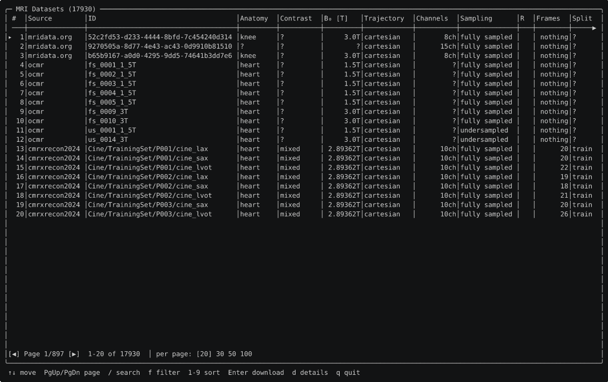

# Usage

New to raw k-space, ISMRMRD or the catalog vocabulary? Read [Concepts & data model](@ref)
first, then the [Tutorial](@ref) for an end-to-end walk-through. This page is the
reference for every user-facing feature. Archive-fetching mechanics and maintainer
scripts are in [Internals & maintainer notes](@ref).

!!! warning "Data source terms of use"
    MRITestData downloads files from external repositories. Each source has its own
    terms you must agree to **before** using the data in your work — see
    [Licensing & legal](@ref) for the full list and citations. Call
    `MRITestData.dismiss_terms_notice!()` to suppress the startup reminder once you
    have reviewed them.

## Discovering datasets

Two entry points:

| Function | Scope | Matches on |
|---|---|---|
| [`list_datasets`](@ref)`(source; filters...)` | **one** source | core [`DatasetEntry`](@ref) fields |
| [`query`](@ref)`(; sources = …, filters...)` | **one or several** sources (all by default) | core fields **+** `extra` keys **+** `text` free-text search |

```julia
using MRITestData

list_sources()                                    # every supported source
list_datasets(OCMR_SOURCE; fully_sampled = true)
list_datasets(MRIDATA; anatomy = :knee, field_strength = 3.0)
```

### Filters

A filter matches a [`DatasetEntry`](@ref) field by a scalar (`==`), a vector/tuple
(membership), or a predicate function:

```julia
list_datasets(MRIDATA; receiver_channels = c -> c !== nothing && c >= 8)
list_datasets(OCMR_SOURCE; field_strength = (1.5, 3.0))
```

Field names, value vocabularies and units follow the **DICOM** standard wherever DICOM
has an attribute for the concept (`anatomy` is Body Part Examined, `contrast` is
Acquisition Contrast, …); seven fields with no DICOM equivalent are documented
extensions. See [Taxonomy](@ref).

Many fields are optional, and `nothing` is their honest value when a source records
none. `nothing` is therefore a **value to match**, not a wildcard — use it to find
entries where something is unknown. To not filter on a field, omit the keyword or pass
`missing`:

```julia
list_datasets(FASTMRI; receiver_channels = nothing)   # channel count not recorded
list_datasets(OCMR_SOURCE; fully_sampled = nothing)   # sampling status unknown
list_datasets(MRIDATA; vendor = missing)              # no filter — same as omitting it
```

### Searching across sources

[`query`](@ref) searches **one or several** sources at once with the same filter
vocabulary. Unknown keywords are matched against each entry's `extra` metadata, and
`text` does a case-insensitive substring (or `Regex`/predicate) search over the name,
id, and string-valued `extra` fields:

```julia
query(; anatomy = :knee, fully_sampled = true)        # every source
query(; sources = OCMR_SOURCE, field_strength = (1.5, 3.0))
query(; text = "prisma")                              # free-text
query(; cohort = :patient)                            # patients, not volunteers
query(; sources = OCMR_SOURCE, scanner_model = "Siemens MAGNETOM Sola")   # an OCMR `extra` field
```

The `missing`/`nothing` distinction applies to `extra` keys too: a key the entry does
not carry reads as `nothing`. Use [`extra_schema`](@ref)`(source)` to see which keys a
source carries.

### String queries

[`query`](@ref) also has a string-expression form for compound conditions that don't fit
one flat keyword filter — the same language the browser's `/` overlay uses:

```julia
query("dataset=fastmri AND R<3")
query("id='fs_*'")
query("(anatomy=knee AND R<3) OR fully_sampled=true")
```

```
or_expr  := and_expr (OR and_expr)*
and_expr := atom (AND atom)*
atom     := '(' or_expr ')' | field OP value
OP       := '=' | '!=' | '<' | '<=' | '>' | '>='
```

`AND`/`OR` are case-insensitive keywords and `AND` binds tighter than `OR`; parenthesize
to override. A value is a bare word, a `'single'`/`"double"`-quoted string, or a number. A
string containing `*` is a case-insensitive glob (`*` matches any run of characters,
anchored to the whole value); without `*` it's an exact case-insensitive compare.
`<`/`<=`/`>`/`>=` compare numerically and never match a non-numeric or missing field.

`field` accepts any [`DatasetEntry`](@ref) field name, a friendly alias matching the
browser's column headers (`dataset`/`source`, `r`/`accel` → `acceleration`, `b0` →
`field_strength`, `channels` → `receiver_channels`, `frames` → `num_frames`, `size` →
`approx_size_bytes`, `sampling` → the fully-sampled/pattern value the browser displays),
or a per-source `extra` key — all case-insensitive. `strict = true` errors on an unknown
field instead of `@warn`ing and matching nothing, same as the keyword form.

## Interactive browser



MRITestData ships a full-screen terminal browser built on
[Tachikoma.jl](https://github.com/kahliburke/Tachikoma.jl)'s `PagedDataTable`. Call it
from the Julia REPL:

```julia
using MRITestData
run_browser()                          # browse all sources
run_browser(; sources = OCMR_SOURCE)   # one source only
run_browser(; offline = true)          # skip the network
```

Inside the browser:

- **↑ ↓** — move the selection; **PgUp/PgDn**, **Home/End** — change page.
- **`/`** — open the expression query overlay (see [String queries](@ref)); Enter
  applies, Esc cancels.
- **`f`** — open the filter modal (per-column typed filters; single column, AND-only —
  applying an expression query resets this).
- **`c`** — open the column-visibility picker: **Space** toggles the highlighted column,
  **Enter** applies, **Esc** cancels. `"#"` (the row index) is always shown.
- **`1`-`9`** — sort by that column (toggles ascending/descending).
- **`d`** — open the details pane: every `extra` key the highlighted dataset carries,
  with its description and its `query`/`list_datasets` keyword (`Esc`/`d` closes it).
- **Enter** — select the highlighted dataset and start the download flow.
- **`q` / Esc** — quit without downloading.

Narrowing `run_browser(; sources = ...)` to a single source adds a couple of that
source's most useful `extra` fields as real, sortable/filterable columns (e.g. OCMR
gets a `scanner_model` column) — see [`run_browser`](@ref) for the full list; they're
also toggleable from the column picker and queryable by their `extra_schema` key. After
selecting a dataset you confirm the download (`y`/`n`) and choose a destination path
(default `<current directory>/<id>.h5`).

### Standalone shell command

MRITestData can also be installed as a standalone `mridata-browser` command:

```julia
using Pkg
Pkg.Apps.add("MRITestData")                  # from the registry
Pkg.Apps.develop(path = "/path/to/MRITestData")   # from a local clone
```

With `~/.julia/bin` on your `PATH`:

```sh
mridata-browser                     # browse every source
mridata-browser --offline           # bundled index, no network
mridata-browser --source ocmr       # one source (repeatable; names match `source_name`)
```

## The self-updating index

`MRIDATA` and `OCMR_SOURCE` are backed by an **index** fetched from upstream and cached
in a scratchspace:

- **OCMR** — the authoritative `ocmr_data_attributes.csv` from OCMR's S3 bucket.
- **mridata.org** — scraped from `mridata.org/list` (the site has no JSON API).

The index is downloaded on first use, then refreshed automatically once older than
[`MRITestData.INDEX_TTL_DAYS`](@ref) (default 30 days). On any network failure the
bundled index that ships with the package is used instead, so discovery always works
offline. The other five sources ship a **static** committed index and behave identically
online and offline (`refresh_index` is a no-op that reports the path).

```julia
refresh_index(OCMR_SOURCE)     # force a refresh now
refresh_index()                # every source
index_age_days(OCMR_SOURCE)    # nothing if never fetched (bundled fallback in use)

list_datasets(OCMR_SOURCE; offline = true)   # skip the network entirely

MRITestData.INDEX_TTL_DAYS[] = 7             # refresh weekly
```

## Downloading and caching

```julia
entry = first(list_datasets(OCMR_SOURCE; fully_sampled = true))
path  = download_dataset(entry)            # -> Scratch cache, returns the local path
```

Downloads stream to a temporary `.part` file and are renamed atomically on success, so
an interrupted transfer never poisons the cache. A `ProgressMeter` bar is shown by
default (`progress = false` to opt out). A `max_bytes` guard prevents accidentally
pulling a very large file:

```julia
download_dataset(entry; progress = false, max_bytes = 2_000_000_000)
```

For archive-backed sources this fetches **only the requested file's bytes** via HTTP
range requests — see [Internals: random-access extraction](@ref) and the
[disk-footprint reference](@ref "Disk-footprint reference").

Cache management:

```julia
cache_path(entry); is_cached(entry)
clear_cache()                       # all sources
clear_cache(; source = OCMR_SOURCE) # one source
```

[`copy_dataset`](@ref) ensures a file is available at a path of your choice, copying
from the cache without an HTTP request when it is already present and unmodified:

```julia
copy_dataset(entry; dest = "/data/my_scan.h5")
```

## Loading the raw data

[`load_raw`](@ref) accepts an ISMRMRD file **path** *or* a
[`DatasetEntry`](@ref)/[`DatasetHandle`](@ref) directly (downloaded and cached on first
use) and always returns an `MRIBase.RawAcquisitionData`:

```julia
raw = load_raw(entry)        # profiles + parsed XML header
```

See [What `load_raw` returns](@ref) for the structure and the axis conventions. This
works uniformly for every source: ISMRMRD sources load directly; `.mat` and
fastMRI-layout sources are converted to a cached ISMRMRD file transparently.

### Per-source notes

| Source | Native format | On load | Reconstruct with |
|---|---|---|---|
| `MRIDATA` | ISMRMRD `.h5` | direct | direct FFT |
| `OCMR_SOURCE` | ISMRMRD `.h5` | direct (ECG block stripped, see below) | direct FFT (`fs_*`) / CG-SENSE (`us_*`) |
| `CMRXRECON2024` | MATLAB v7.3 `.mat` | → cached Cartesian ISMRMRD | direct FFT (fully sampled) |
| `CMRXRECON300` | MATLAB v7.3 `.mat` (`Recon_ks` + `Calib`) | → cached ISMRMRD, marked **undersampled**, ACS lines included | **CG-SENSE** with the ACS |
| `USC_SPEECH` | MRD/ISMRMRD `.h5` (spiral + trajectory + DCF) | direct, **non-Cartesian** | non-Cartesian (NUFFT + DCF) |
| `M4RAW` | fastMRI HDF5 | → cached Cartesian ISMRMRD (all-true mask) | direct FFT |
| `FASTMRI` | fastMRI HDF5 | → cached ISMRMRD; train/val fully sampled, test masked | direct FFT / CG-SENSE (test, prostate, breast) |

- **CMRxRecon coils.** CMRxRecon2024 is SVD-compressed to 10 virtual channels
  (`entry.coil_data == :derived`; physical count in `entry.extra["multi_coil_elements"]`).
  CMRxRecon-300 keeps its 30 physical channels.
- **CMRxRecon FOV.** Not shipped upstream; a placeholder (matrix size in mm) is written
  while the encoding/recon matrix reflects the true dimensions.
- **OCMR ECG header.** OCMR cine files carry a `<waveformInformation>` block that trips a
  MRIFiles parser bug; `load_raw` strips it from the cached HDF5 in place on first load.
- **CMRxRecon raw arrays.** `MRITestData.load_mat(entry)` returns the `.mat` contents as
  a `Dict` (e.g. `d["kspace_full"]`) if you want to bypass the ISMRMRD conversion.
- **CMRxRecon data types.** The six CMRxRecon2024 series (Cine, Mapping, Tagging, Aorta,
  Flow2d, BlackBlood) and the CMRxRecon-300 series (Cine SAX/LAX, T1/T2 map) are
  decomposed onto `contrast`/`orientation`/`sequence`/`quantitative`/`cardiac_sync`/… —
  see [Dataset contents](@ref) for the full per-series table and filter examples.

### fastMRI: form-gated credentials

Access is form-gated. Fill the request form at
[fastmri.med.nyu.edu](https://fastmri.med.nyu.edu); the confirmation email contains AWS
S3 **pre-signed URLs** (one per anatomy + coil type + split), valid **90 days**.
Register them all at once with [`set_fastmri_urls!`](@ref) — pass the whole email body
or just the `curl` block:

```julia
using MRITestData

MRITestData.set_fastmri_urls!(read("fastmri_email.txt", String))
MRITestData.fastmri_url_expires()    # DateTime UTC, or nothing if not stored

# After the offset map is committed (maintainer task), use the standard API:
entries = list_datasets(FASTMRI; offline = true, anatomy = :knee)
raw     = load_raw(first(entries))
```

Until a populated `data/fastmri_map.csv` is committed, `list_datasets(FASTMRI)` is empty
even with valid URLs — building it is a maintainer task
([Internals & maintainer notes](@ref)). When credentials expire, request new links and
call `set_fastmri_urls!` again.

## Reconstruction with MRIReco

MRITestData yields an `MRIBase.RawAcquisitionData` and stops there. Reconstruction is
left to a dedicated package such as
[MRIReco.jl](https://github.com/MagneticResonanceImaging/MRIReco.jl): convert to an
`AcquisitionData` and reconstruct.

### Fully-sampled data → direct reconstruction

```julia
using MRITestData, MRIReco

entry = first(list_datasets(OCMR_SOURCE; fully_sampled = true))
raw   = load_raw(entry)

acq = AcquisitionData(raw)                  # re-exported by MRIReco (from MRIBase)
params = MRIReco.defaultRecoParams()
params[:reco] = "direct"
img = MRIReco.reconstruction(acq, params)   # AxisArray [x, y, z, echo, coil, rep]
```

`echo` carries the temporal/parametric axis (cine frames, mapping weightings). Combine
coils with a root-sum-of-squares over the coil axis.

### Reconstructing undersampled data

`OCMR` `us_*` files, all of `CMRXRECON300`, and fastMRI test/prostate/breast are
**undersampled** — a direct recon aliases. Use CG-SENSE (`"multiCoil"`) with coil
sensitivity maps estimated by ESPIRiT from the calibration region:

```julia
using MRITestData, MRIReco, MRICoilSensitivities
using MRIBase: flag_is_set, flag_remove!

entry = first(list_datasets(CMRXRECON300; offline = true))   # R ≈ 3, ships ACS
raw   = load_raw(entry)
acq   = AcquisitionData(raw)

params = MRIReco.defaultRecoParams()
params[:reco] = "multiCoil"

# The ACS lines are in the same file, flagged ACQ_IS_PARALLEL_CALIBRATION.
# AcquisitionData drops them from the imaging data; rebuild a calibration-only
# acquisition (flag cleared) to estimate the sensitivity maps. Fall back to
# self-calibration from the imaging data when no ACS lines are present.
calib = [p for p in raw.profiles if flag_is_set(p, "ACQ_IS_PARALLEL_CALIBRATION")]
if !isempty(calib)
    clean = deepcopy(calib)
    foreach(p -> flag_remove!(p, "ACQ_IS_PARALLEL_CALIBRATION"), clean)
    acq_calib = AcquisitionData(RawAcquisitionData(raw.params, clean))
    params[:senseMaps] = espirit(acq_calib, (6, 6), 24; eigThresh_1 = 0.02, eigThresh_2 = 0.95)
else
    params[:senseMaps] = espirit(acq, (6, 6), 24; eigThresh_1 = 0.02, eigThresh_2 = 0.95)
end

img = MRIReco.reconstruction(acq, params)   # de-aliased, coil-combined (channel axis = 1)
```

For compressed-sensing regularised variants (`"multiCoilCS"`, TV / wavelet priors), see
the MRIReco.jl documentation.

### Method references

- **SENSE** — Pruessmann KP, Weiger M, Scheidegger MB, Boesiger P. *SENSE: Sensitivity
  encoding for fast MRI.* Magn Reson Med, 1999, 42(5): 952–962.
- **CG-SENSE (non-Cartesian, iterative)** — Pruessmann KP, Weiger M, Börnert P, Boesiger
  P. *Advances in sensitivity encoding with arbitrary k-space trajectories.* Magn Reson
  Med, 2001, 46(4): 638–651.
- **ESPIRiT** — Uecker M, Lai P, Murphy MJ, et al. *ESPIRiT — an eigenvalue approach to
  autocalibrating parallel MRI: Where SENSE meets GRAPPA.* Magn Reson Med, 2014, 71(3):
  990–1001.
- **Compressed sensing MRI** — Lustig M, Donoho D, Pauly JM. *Sparse MRI: The application
  of compressed sensing for rapid MR imaging.* Magn Reson Med, 2007, 58(6): 1182–1195.
- **MRIReco.jl** — Knopp T, Grosser M. *MRIReco.jl: An MRI reconstruction framework
  written in Julia.* Magn Reson Med, 2021, 86(3): 1633–1646.
- **ISMRMRD format** — Inati SJ, Naegele JD, Zwart NR, et al. *ISMRM Raw Data format:
  A proposed standard for MRI raw datasets.* Magn Reson Med, 2017, 77(1): 411–421.

### Verified across every source

`examples/reconstruct_all_types.jl` reconstructs a representative sample of each source
and modality and was verified to succeed on all of them:

| Source / modality | Example recon dimensions `[x, y, z, echo, coil, rep]` |
| --- | --- |
| CMRxRecon-300 Cine SAX | `(512, 162, 6, 24, 30, 1)` — 6 slices × 24 frames, 30 coils |
| CMRxRecon-300 Cine LAX | `(448, 168, 19, 4, 30, 1)` |
| CMRxRecon-300 T1 / T2 map | `(512, 144, 5, 9, 30, 1)` / `(384, 116, 5, 3, 30, 1)` — echo axis = weightings |
| CMRxRecon2024 Cine / Mapping | `(416, 168, 1, 12, 10, 1)` / `(384, 116, 5, 3, 10, 1)` — 10 virtual coils |
| CMRxRecon2024 Aorta / Tagging / Flow2d | `(416, 168, 2, 12, 10, 1)` / `(448, 180, 3, 12, 10, 1)` / `(384, 144, 2, 12, 10, 1)` |
| CMRxRecon2024 BlackBlood | `(512, 156, 5, 1, 10, 1)` — single contrast (no temporal axis) |
| mridata.org (3-D Cartesian) | `(640, 368, 41, 1, 15, 1)` — 41 slices, 15 coils |
| OCMR (cardiac cine) | `(512, 208, 1, 1, 15, 1)` |

#### Representative reconstructions

Coil-combined (sum-of-squares) magnitude images, produced by
`docs/generate_recon_images.jl` (readout axis cropped to remove CMRxRecon's 2×
oversampling). They are pre-rendered and committed because reconstruction needs MRIReco
plus real data downloads (a Synapse token and several GB).

CMRxRecon2024 — BlackBlood (dark-blood anatomical slices, blood pool nulled):


mridata.org — slices through a fully-sampled 3-D Cartesian volume:


OCMR — a cardiac cine frame:


**CMRxRecon-300 is k-t undersampled** (here R ≈ 3), so the *same direct recon* shows the
expected aliasing — the heart replicated along the phase-encode direction. `load_raw`
records the true sampling pattern, so this is faithful; an artifact-free image needs
CG-SENSE with the paired ACS `_calib` data (`entry.locator["calib_path"]`):


## Persistent settings

Tunables persisted across sessions via `LocalPreferences.toml`:

```julia
# Terms-of-use notice
MRITestData.dismiss_terms_notice!()   # suppress startup warning (after reviewing terms)
MRITestData.enable_terms_notice!()

# Parallel download chunks (default 4; 1 disables) and the minimum size for chunking
MRITestData.set_chunk_size!(8)
MRITestData.set_min_file_size!(4 * 1024 * 1024)

# Dataset-index TTL in days (default 30)
MRITestData.set_refresh_period!(7)

# Synapse token (CMRxRecon2024 and CMRxRecon-300)
MRITestData.set_synapse_token!("your-synapse-pat")

# fastMRI signed URLs (paste the full email body or curl-command block)
MRITestData.set_fastmri_urls!(email_text)
MRITestData.fastmri_url_expires()
```

See [FAQ & troubleshooting](@ref) for credential setup and common errors.
