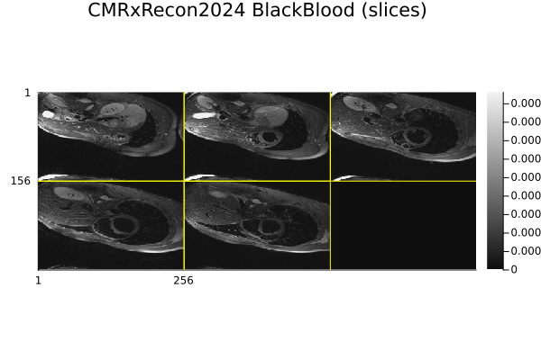
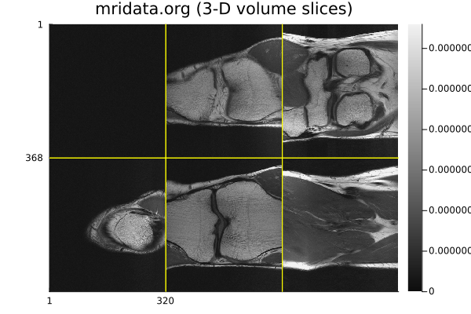
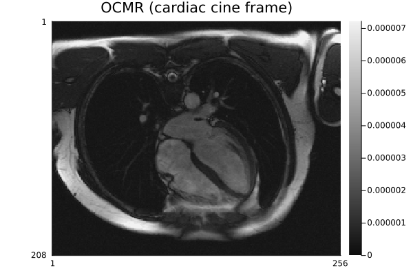
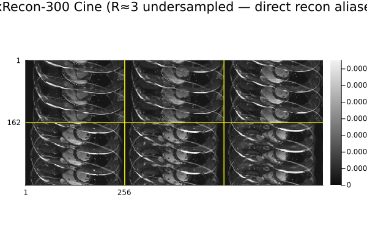

# Usage

!!! warning "Data source terms of use"
    MRITestData downloads files from external repositories. Each source has its own
    terms of use that you must agree to **before** using the data in your work:

    - **mridata.org** → [http://mridata.org/terms](http://mridata.org/terms)
    - **OCMR** → [https://www.ocmr.info/download/](https://www.ocmr.info/download/)
    - **CMRxRecon2024** → [https://cmrxrecon.github.io/2024/FAQ.html](https://cmrxrecon.github.io/2024/FAQ.html)
    - **CMRxRecon-300** → [https://www.synapse.org/Synapse:syn52965326](https://www.synapse.org/Synapse:syn52965326)
    - **USC Speech** → [https://creativecommons.org/licenses/by/4.0/](https://creativecommons.org/licenses/by/4.0/)
    - **M4Raw** → [https://creativecommons.org/licenses/by/4.0/](https://creativecommons.org/licenses/by/4.0/)

    Call `MRITestData.dismiss_terms_notice!()` to permanently suppress the startup
    reminder once you have reviewed the terms.

## Discovering datasets

```julia
using MRITestData

list_sources()                                    # [MRIDATA, OCMR_SOURCE]
list_datasets(OCMR_SOURCE; fully_sampled = true)
list_datasets(MRIDATA; anatomy = :knee, field_strength = 3.0)
```

Filters match a [`DatasetEntry`](@ref) field by a scalar (`==`), a vector/tuple
(membership), or a predicate function:

```julia
list_datasets(MRIDATA; coils = c -> c !== nothing && c >= 8)
list_datasets(OCMR_SOURCE; field_strength = (1.5, 3.0))
```

### Searching across sources

[`query`](@ref) searches **one or several** sources at once with the same filter
vocabulary. Unknown keywords are matched against each entry's `extra` metadata, and
`text` does a case-insensitive substring (or `Regex`/predicate) search over the
name, id, and string-valued `extra` fields:

```julia
query(; anatomy = :knee, fully_sampled = true)        # both sources
query(; sources = OCMR_SOURCE, field_strength = (1.5, 3.0))
query(; text = "prisma")                              # free-text
query(; subject = "patient")                          # an OCMR `extra` field
```

### Interactive browser

MRITestData ships a full-screen terminal browser built on
[Tachikoma.jl](https://github.com/kahliburke/Tachikoma.jl)'s `PagedDataTable`.
Call it directly from the Julia REPL:

```julia
using MRITestData
run_browser()                            # browse all sources
run_browser(; sources = OCMR_SOURCE)    # one source only
run_browser(; offline = true)           # skip the network
```

Inside the browser:
- **↑ ↓** — move the selection; **PgUp/PgDn**, **Home/End** — change page.
- **`/`** — global text search across all columns.
- **`f`** — open the filter modal (per-column typed filters).
- **`1`-`9`** — sort by that column (toggles ascending/descending).
- **Enter** — select the highlighted dataset and start the download flow.
- **`q` / Esc** — quit without downloading.

After selecting a dataset you are asked to confirm the download (`y`/`n`) and to
choose a destination path. The default is `<current directory>/<id>.h5`; press
Enter to accept it.

**Standalone shell command (optional)**

MRITestData can also be installed as a standalone `mridata-browser` command
(adds it to `~/.julia/bin`):

```julia
using Pkg
Pkg.Apps.add("MRITestData")          # from the registry
# or, from a local clone:
Pkg.Apps.develop(path = "/path/to/MRITestData")
```

Make sure `~/.julia/bin` is on your `PATH`, then launch:

```sh
mridata-browser            # browse all sources
mridata-browser --offline  # use the bundled index without hitting the network
```

## The self-updating index

Each source's catalog is backed by an **index** that is fetched from upstream and
cached in a scratchspace:

- **OCMR** — the authoritative `ocmr_data_attributes.csv` from OCMR's S3 bucket.
- **mridata.org** — scraped from `mridata.org/list` (the site has no JSON API).

The index is downloaded on first use, then refreshed automatically once it is older
than [`MRITestData.INDEX_TTL_DAYS`](@ref) (default 30 days). On any network failure
the bundled index that ships with the package is used instead, so discovery always
works offline.

```julia
refresh_index(OCMR_SOURCE)     # force a refresh now (manual trigger)
refresh_index()                # refresh every source
index_age_days(OCMR_SOURCE)    # nothing if never fetched (bundled fallback in use)

# Skip the network entirely (used by CI/offline tests):
list_datasets(OCMR_SOURCE; offline = true)
```

To change the refresh period:

```julia
MRITestData.INDEX_TTL_DAYS[] = 7   # refresh weekly
```

## Downloading and caching

```julia
entry = first(list_datasets(OCMR_SOURCE; fully_sampled = true))
path  = download_dataset(entry)            # ISMRMRD .h5 -> Scratch cache, returns path
```

Downloads stream to a temporary `.part` file and are renamed atomically on success,
so an interrupted transfer never poisons the cache. A `ProgressMeter` bar is shown
by default; pass `progress = false` to opt out. A generous `max_bytes` guard can
prevent accidentally pulling very large files:

```julia
download_dataset(entry; progress = false, max_bytes = 2_000_000_000)
```

Cache management:

```julia
cache_path(entry); is_cached(entry)
clear_cache()                       # all sources
clear_cache(; source = OCMR_SOURCE) # one source
```

## Working with the raw data

[`load_raw`](@ref) accepts an ISMRMRD file path **or** a
[`DatasetEntry`](@ref)/[`DatasetHandle`](@ref) directly — the dataset is downloaded
(and cached) on first use:

```julia
raw = load_raw(entry)        # MRIBase.RawAcquisitionData (profiles + XML header)
```

This works uniformly for every source. OCMR and mridata.org files are already
ISMRMRD; CMRxRecon2024 files are MATLAB k-space and are converted to a cached ISMRMRD
file transparently (see below). To reconstruct, build an `AcquisitionData` from the
`RawAcquisitionData` and hand it to a reconstruction package — see
[Reconstruction with MRIReco](@ref).

### CMRxRecon2024: k-space to ISMRMRD

CMRxRecon2024 distributes each acquisition as a MATLAB `.mat` k-space array. The
catalog exposes the **fully-sampled** ground-truth acquisitions; MRITestData builds a
valid Cartesian ISMRMRD file the first time you load an entry, so CMRxRecon flows
through the same `load_raw` pipeline as every other source:

```julia
entry = first(list_datasets(CMRXRECON2024; offline = true))
raw   = load_raw(entry)              # downloads the .mat, converts, loads
```

- All CMRxRecon k-space is Cartesian; each acquisition is stored as one ISMRMRD profile
  per phase-encode line, with temporal frames mapped to ISMRMRD contrasts.
- Coils are SVD-compressed to 10 virtual channels (the physical element count is kept
  in `entry.extra["hardware_coils"]`).
- CMRxRecon does not ship a field of view; a placeholder (matrix size in mm) is written,
  while the encoding/recon matrix size reflects the true dimensions.

If you need the raw MATLAB arrays instead of ISMRMRD, `MRITestData.load_mat`
returns the `.mat` contents as a `Dict`:

```julia
d = MRITestData.load_mat(entry)     # e.g. d["kspace_full"]
```

### CMRxRecon-300: random-access extraction from split `.tar.gz`

CMRxRecon-300 ships raw k-space (`Recon_ks`) as `.tar.gz` archives split into 16 GiB
fragments. The `_ks` files are **undersampled** (a regular k-t pattern, R≈3) paired with
fully-sampled ACS `_calib` files; `load_raw` reads the true acquired-line pattern from the
data, so the resulting `RawAcquisitionData`/`AcquisitionData` is correctly marked
undersampled (an artifact-free image needs parallel imaging — ESPIRiT/CG-SENSE with the
ACS — not a plain inverse FFT). Because a `.tar.gz` is one continuous gzip stream, it cannot be
range-extracted per file like a ZIP. Instead the package ships a precomputed **zran**
(zlib random-access) checkpoint index with one checkpoint placed just before each file:
to fetch one `.mat` it resumes decompression immediately before that file and issues HTTP
range requests, streaming essentially just the file rather than the whole (≈120–260 GB)
archive. Loading is otherwise identical to every other source:

```julia
entry = first(list_datasets(CMRXRECON300; offline = true))
raw   = load_raw(entry)              # zran-extracts the .mat, converts, loads
```

Files are stored as Cartesian ISMRMRD (one profile per phase-encode line, frames →
contrasts), the same as CMRxRecon2024. Building or refining the checkpoint index from the
archives is a maintainer task — see `scripts/index_cmrxrecon300.jl` and `scripts/README.md`.

### USC Speech: non-Cartesian spiral + figshare ZIP range-extraction

The USC SPAN 75-speaker dataset is the package's first **non-Cartesian** source: real-time
speech production MRI acquired on a GE Signa Excite **1.5 T** scanner with an 8-channel
upper-airway array using a **13-interleaf spiral-out** spoiled GRE. Only the **2drt**
mid-sagittal vocal-tract raw k-space is cataloged. Unlike the CMRxRecon sources, the raw
data already ships as vendor-agnostic **MRD/ISMRMRD `.h5`** — it stores the spiral k-space
samples together with their trajectory (k-space coordinate) and density-compensation tables
— so there is no `.mat`→ISMRMRD conversion: it flows straight through the default
`load_raw` path. Because the trajectory is non-Cartesian, the loaded `RawAcquisitionData`'s
`params["trajectory"]` is *not* `"cartesian"`; build a non-Cartesian `AcquisitionData` (with
the trajectory + density compensation) for reconstruction rather than an inverse FFT.

The whole corpus is a single ~570 GB `dataset.zip` on figshare (CC-BY, no account). To pull
one `.h5` member the package reads the archive's ZIP central directory once — committed as
`data/usc_speech_map.csv`, recording each member's byte span, local-header length and
compression method — and issues a single HTTP **range** request for that member, stripping
the ZIP local header and inflating it if DEFLATE. figshare's `ndownloader` 302-redirects to
a short-lived presigned S3 URL (which supports ranges); the URL is resolved immediately
before the range GET and re-resolved once on a 403 (expiry). Loading is otherwise identical
to every other source:

```julia
entry = first(list_datasets(USC_SPEECH; offline = true))
raw   = load_raw(entry)              # ZIP range-extracts + inflates the .h5, then loads
```

Regenerating the offset map from the figshare archive is a maintainer task — see
`scripts/generate_usc_speech_map.jl` and `scripts/README.md`.

### M4Raw: fastMRI-layout low-field brain + Zenodo ZIP range-extraction

The M4Raw dataset is the package's first **low-field (0.3 T) brain** source: multi-contrast
(T1w / T2w / FLAIR, plus T1 GRE), multi-repetition k-space from 183 volunteers acquired with
a **4-channel** head coil. Each member is one *study × contrast × repetition* of
**fully-sampled Cartesian** k-space in the **fastMRI HDF5** layout — three datasets
(`kspace`, shaped `(slices, coils, freq, phase)`; `reconstruction_rss`; and an
`ismrmrd_header` XML string). Because that is not a complete ISMRMRD file, the package
converts the k-space to a cached Cartesian ISMRMRD on first load (reusing the same builder as
the CMRxRecon sources, with an all-true / fully-sampled mask). The loaded
`RawAcquisitionData`'s `params["trajectory"]` is `"cartesian"`, so a plain inverse FFT (a
gridding / "direct" reconstruction) reconstructs it — no parallel imaging required.

The corpus ships as several multi-GB ZIPs on Zenodo (CC-BY, no account). To pull one `.h5`
member the package reads each archive's ZIP central directory once — committed as
`data/m4raw_map.csv`, recording each member's byte span, local-header length and compression
method — and issues a single HTTP **range** request for that member, stripping the ZIP local
header and inflating it if DEFLATE. Loading is otherwise identical to every other source:

```julia
entry = first(list_datasets(M4RAW; offline = true))
raw   = load_raw(entry)              # ZIP range-extracts + inflates the .h5, then converts + loads
```

Regenerating the offset map from the Zenodo archives is a maintainer task — see
`scripts/generate_m4raw_map.jl` and `scripts/README.md`.

### CMRxRecon data types

Both CMRxRecon sources are cardiac, multi-coil, Cartesian k-space from Siemens 3 T
scanners, but they span several acquisition *modalities* and *views*. The file name encodes
them (e.g. `cine_sax_ks`, `t1map_ks`, `blackblood`); the modality is also surfaced in
`entry.extra["modality"]`. Each acquisition is 5‑D `(kx, ky, coils, slices, frames)` — 4‑D
when there is no temporal/parametric axis (e.g. BlackBlood) — and loads as Cartesian
ISMRMRD with the last axis mapped to ISMRMRD *contrasts*.

**Views.** Cardiac imaging uses two standard slice orientations:

- **SAX — short-axis.** A stack of parallel slices cutting across the left ventricle (a
  "bread-loaf" of the heart). The slice axis holds multiple short-axis levels (base →
  apex). Used for volumes/function and for most mapping.
- **LAX — long-axis.** Slices along the heart's long axis. The slice axis instead holds the
  standard long-axis *views* — 2‑chamber (2ch), 3‑chamber (3ch) and 4‑chamber (4ch).

**Modalities.**

- **Cine** (`cine_sax`, `cine_lax`) — a balanced‑SSFP *movie* of the beating heart across
  the cardiac cycle; the frame axis is time. The workhorse for cardiac function and the
  largest acquisitions (many frames × slices/views).
- **Mapping** — quantitative parametric mapping; the last axis is a series of differently
  *weighted* images (not time) acquired to fit a relaxation curve:
  - **T1 mapping** (`t1map`) — images at several inversion times (MOLLI-style); fit yields
    a per-pixel T1 map (myocardial fibrosis/oedema).
  - **T2 mapping** (`t2map`) — images at several T2-preparation echo times; fit yields a
    per-pixel T2 map (oedema/inflammation).
- **Tagging** (`tagging`, CMRxRecon2024) — cine with a saturation *tag* grid laid over the
  myocardium so tag deformation reveals regional strain.
- **Aorta** (`aorta`, CMRxRecon2024) — cine of the aorta (sagittal/transverse) for vessel
  anatomy and pulsatility.
- **Flow2d** (`flow2d`, CMRxRecon2024) — 2‑D phase-contrast velocity mapping; encodes
  through-plane blood velocity (e.g. for flow quantification).
- **BlackBlood** (`blackblood`, CMRxRecon2024) — a dark-blood-prepared *anatomical* scan
  (blood signal nulled) for vessel-wall / morphology. It has **no temporal axis** (4‑D),
  so it loads as a single-contrast Cartesian acquisition.

CMRxRecon‑300 provides **Cine (SAX + LAX) and T1/T2 mapping** for all 300 subjects.
CMRxRecon2024 adds **Tagging, Aorta, Flow2d and BlackBlood**. Filter by modality with, e.g.

```julia
list_datasets(CMRXRECON2024; offline = true)                 # all modalities
query(; sources = CMRXRECON2024, modality = "BlackBlood", offline = true)
query(; sources = CMRXRECON300,  modality = "Cine SAX",   offline = true)
```

### Copying a dataset to a custom location

[`copy_dataset`](@ref) ensures the file is available at a destination path of your
choice. If the file is already in the Scratch cache and unmodified, only a local
copy is made — no HTTP request is issued:

```julia
copy_dataset(entry; dest = "/data/my_scan.h5")
```

## Reconstruction with MRIReco

MRITestData provides the data-loading pipeline and yields an
`MRIBase.RawAcquisitionData`. Reconstruction is left to a dedicated package such as
[MRIReco.jl](https://github.com/MagneticResonanceImaging/MRIReco.jl); convert the raw
data to an `AcquisitionData` and reconstruct:

```julia
using MRITestData, MRIReco

# 1. Download and load (works for any source; pass the entry directly)
entry = first(list_datasets(OCMR_SOURCE; fully_sampled = true))
raw   = load_raw(entry)

# 2. Build the AcquisitionData MRIReco expects, then reconstruct
acq = AcquisitionData(raw)
params = MRIReco.defaultRecoParams()
params[:reco] = "direct"
img = MRIReco.reconstruction(acq, params)
```

The result is MRIReco's `AxisArray` with axes `[x, y, z, echo, coil, rep]`.
`AcquisitionData` is re-exported by MRIReco (from `MRIBase`).

This pipeline works for **every source and CMRxRecon modality**. The example script
`examples/reconstruct_all_types.jl` reconstructs a representative sample of each and was
verified to succeed on all of them:

| Source / modality | Example recon dimensions `[x, y, z, echo, coil, rep]` |
| --- | --- |
| CMRxRecon-300 Cine SAX | `(512, 162, 6, 24, 30, 1)` — 6 slices × 24 frames, 30 coils |
| CMRxRecon-300 Cine LAX | `(448, 168, 19, 4, 30, 1)` |
| CMRxRecon-300 T1 / T2 map | `(512, 144, 5, 9, 30, 1)` / `(384, 116, 5, 3, 30, 1)` — frames axis = weightings |
| CMRxRecon2024 Cine / Mapping | `(416, 168, 1, 12, 10, 1)` / `(384, 116, 5, 3, 10, 1)` — 10 virtual coils |
| CMRxRecon2024 Aorta / Tagging / Flow2d | `(416, 168, 2, 12, 10, 1)` / `(448, 180, 3, 12, 10, 1)` / `(384, 144, 2, 12, 10, 1)` |
| CMRxRecon2024 BlackBlood | `(512, 156, 5, 1, 10, 1)` — single contrast (no temporal axis) |
| mridata.org (3-D Cartesian) | `(640, 368, 41, 1, 15, 1)` — 41 slices, 15 coils |
| OCMR (cardiac cine) | `(512, 208, 1, 1, 15, 1)` |

(`echo` carries the temporal/parametric axis — cine frames, mapping weightings; BlackBlood
has none. The CMRxRecon-300 raw data keeps its 30 physical coils, while CMRxRecon2024 ships
10 SVD-compressed virtual coils. The reconstruction here is a plain direct/inverse-FFT
recon: it gives an artifact-free image for the fully-sampled sources, but the
**undersampled CMRxRecon-300** `_ks` data aliases — see below.)

#### Representative reconstructions

Coil-combined (sum-of-squares) magnitude images from the above, produced by
`docs/generate_recon_images.jl` (the readout axis is cropped to remove CMRxRecon's 2×
oversampling). They are pre-rendered and committed rather than built live, because
reconstruction needs MRIReco plus real data downloads (a Synapse token and several GB).

Fully-sampled sources reconstruct cleanly with a direct recon —

CMRxRecon2024 — BlackBlood: dark-blood anatomical slices (blood pool nulled):



mridata.org — slices through a fully-sampled 3-D Cartesian volume:



OCMR — a cardiac cine frame:



In contrast, **CMRxRecon-300 is k-t undersampled** (here R≈3), so the *same* direct recon
shows the expected aliasing — the heart replicated and overlapped along the phase-encode
direction. `load_raw` records the true sampling pattern, so this is faithfully represented;
an artifact-free image requires parallel imaging (ESPIRiT/CG-SENSE) using the paired
fully-sampled ACS `_calib` data (`entry.extra["calib_id"]`):



## Persistent settings

Several tunable parameters can be persisted across Julia sessions via
`LocalPreferences.toml`:

```julia
# Terms-of-use notice
MRITestData.dismiss_terms_notice!()   # suppress startup warning (after reviewing terms)
MRITestData.enable_terms_notice!()    # re-enable it

# Parallel download chunks (default: 4; set to 1 to disable)
MRITestData.set_chunk_size!(8)

# Minimum file size for parallel chunking (default: 8 MiB)
MRITestData.set_min_file_size!(4 * 1024 * 1024)

# Dataset-index TTL in days (default: 30)
MRITestData.set_refresh_period!(7)
```
